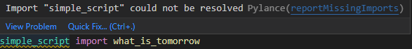

# Progress Notes
## `.env` file
1. Added `"python.envFile": "${workspaceRoot}/.env"` to workspace settings:
```
	"settings": {
		"python.envFile": "${workspaceRoot}/.env",
	},
```
with the `.env` file containing:
```
HOME_PATH="${USERPROFILE}"
WORKSPACE_FOLDER="${HOME_PATH}/Documents\\Python Scripts/TestPathPackage"
PYTHONPATH="${WORKSPACE_FOLDER}/tests;${WORKSPACE_FOLDER};${WORKSPACE_FOLDER}/examples;${WORKSPACE_FOLDER}/src;${PYTHONPATH}"
```
- This had no effect when using `Run Python File`


2. Added `launch` configuration 
(required to use `Run and Debug`)  
to workspace settings:
```
"launch": {
    "version": "0.2.0",
    "configurations": [

        {
            "name": "Python: Current File",
            "type": "python",
            "request": "launch",
            "program": "${file}",
            "console": "integratedTerminal",
            "cwd": "${fileDirname}",
            "env": {"PYTHONPATH": "${workspaceFolder}/src;${env:PYTHONPATH}"},
            "justMyCode": true
        }
    ]
}
```
- This had no effect when using `Run Python File`


- Using `Run and Debug`

Got the following output:
```
In module: __main__
current path is: C:\Users\smoke\Documents\Python Scripts\TestPathPackage\examples

PythonPaths:
        c:\Users\smoke\Documents\Python Scripts\TestPathPackage\examples
        C:\Documents\Python Scripts\TestPathPackage\tests
        C:\Documents\Python Scripts\TestPathPackage
        C:\Documents\Python Scripts\TestPathPackage\examples
        C:\Documents\Python Scripts\TestPathPackage\src
        C:\Users\smoke\Documents\Python Scripts\TestPathPackage\src
        C:\Users\smoke\Documents\Python Scripts\TestPathPackage\examples
        C:\Users\smoke\.conda\envs\TestPathDev\python39.zip
        C:\Users\smoke\.conda\envs\TestPathDev\DLLs
        C:\Users\smoke\.conda\envs\TestPathDev\lib
        C:\Users\smoke\.conda\envs\TestPathDev
        C:\Users\smoke\.conda\envs\TestPathDev\lib\site-packages
        C:\Users\smoke\.conda\envs\TestPathDev\lib\site-packages\win32
        C:\Users\smoke\.conda\envs\TestPathDev\lib\site-packages\win32\lib
        C:\Users\smoke\.conda\envs\TestPathDev\lib\site-packages\Pythonwin

In module: simple_script

current path is: C:\Users\smoke\Documents\Python Scripts\TestPathPackage\examples

PythonPaths:
        c:\Users\smoke\Documents\Python Scripts\TestPathPackage\examples
        C:\Documents\Python Scripts\TestPathPackage\tests
        C:\Documents\Python Scripts\TestPathPackage
        C:\Documents\Python Scripts\TestPathPackage\examples
        C:\Documents\Python Scripts\TestPathPackage\src
        C:\Users\smoke\Documents\Python Scripts\TestPathPackage\src
        C:\Users\smoke\Documents\Python Scripts\TestPathPackage\examples
        C:\Users\smoke\.conda\envs\TestPathDev\python39.zip
        C:\Users\smoke\.conda\envs\TestPathDev\DLLs
        C:\Users\smoke\.conda\envs\TestPathDev\lib
        C:\Users\smoke\.conda\envs\TestPathDev
        C:\Users\smoke\.conda\envs\TestPathDev\lib\site-packages
        C:\Users\smoke\.conda\envs\TestPathDev\lib\site-packages\win32
        C:\Users\smoke\.conda\envs\TestPathDev\lib\site-packages\win32\lib
        C:\Users\smoke\.conda\envs\TestPathDev\lib\site-packages\Pythonwin

Done module: simple_script


Tomorrow is: Friday, 04. March 2022 09:00AM

Done module: __main__


PS C:\Users\smoke\Documents\Python Scripts\TestPathPackage\examples> 
```
***Path Roots:***
PythonPaths:<br>
> <u>*c:\Users\smoke\Documents\Python Scripts*</u>\TestPathPackage\examples<br>
> <u>**C:\Documents\Python Scripts**</u>\TestPathPackage\tests<br>
> <u>**C:\Documents\Python Scripts**</u>\TestPathPackage<br>
> <u>**C:\Documents\Python Scripts**</u>\TestPathPackage\examples<br>
> <u>**C:\Documents\Python Scripts**</u>\TestPathPackage\src<br>
> <u>*C:\Users\smoke\Documents\Python Scripts*</u>\TestPathPackage\src<br>
> <u>*C:\Users\smoke\Documents\Python Scripts*</u>\TestPathPackage\examples<br>
> C:\Users\smoke\.conda\envs\TestPathDev\python39.zip<br>
> ...
- Where is  <u>**C:\Documents**</u> rather than <u>*c:\Users\smoke\Documents*</u> coming from?

3. Removed `"python.envFile": "${workspaceRoot}/.env"` from workspace settings:
- This had no effect

4. Removed the `.env` file
- Using `Run and Debug`

Got the following output:

```
...
PythonPaths:
        c:\Users\smoke\Documents\Python Scripts\TestPathPackage\examples
        C:\Users\smoke\Documents\Python Scripts\TestPathPackage\src
        C:\Users\smoke\Documents\Python Scripts\TestPathPackage\examples
        C:\Users\smoke\.conda\envs\TestPathDev\python39.zip
        C:\Users\smoke\.conda\envs\TestPathDev\DLLs
        C:\Users\smoke\.conda\envs\TestPathDev\lib
        C:\Users\smoke\.conda\envs\TestPathDev
        C:\Users\smoke\.conda\envs\TestPathDev\lib\site-packages
        C:\Users\smoke\.conda\envs\TestPathDev\lib\site-packages\win32
        C:\Users\smoke\.conda\envs\TestPathDev\lib\site-packages\win32\lib
        C:\Users\smoke\.conda\envs\TestPathDev\lib\site-packages\Pythonwin
...
```

- The <u>**C:\Documents**</u> paths disappeared.


5. Modified `.env` file to explicitly state the path:
```
HOME_PATH="C:\Users\smoke"
WORKSPACE_FOLDER="${HOME_PATH}/Documents/Python Scripts/TestPathPackage"
PYTHONPATH="${WORKSPACE_FOLDER}/tests;${WORKSPACE_FOLDER};${WORKSPACE_FOLDER}/examples;${WORKSPACE_FOLDER}/src;${PYTHONPATH}"
```
- The paths are now all correct.
- some duplicates are present.
```
...
PythonPaths:
        c:\Users\smoke\Documents\Python Scripts\TestPathPackage\examples
        C:\Users\smoke\Documents\Python Scripts\TestPathPackage\tests
        C:\Users\smoke\Documents\Python Scripts\TestPathPackage
        C:\Users\smoke\Documents\Python Scripts\TestPathPackage\examples
        C:\Users\smoke\Documents\Python Scripts\TestPathPackage\src
        C:\Users\smoke\.conda\envs\TestPathDev\python39.zip
        C:\Users\smoke\.conda\envs\TestPathDev\DLLs
        C:\Users\smoke\.conda\envs\TestPathDev\lib
        C:\Users\smoke\.conda\envs\TestPathDev
        C:\Users\smoke\.conda\envs\TestPathDev\lib\site-packages
        C:\Users\smoke\.conda\envs\TestPathDev\lib\site-packages\win32
        C:\Users\smoke\.conda\envs\TestPathDev\lib\site-packages\win32\lib
        C:\Users\smoke\.conda\envs\TestPathDev\lib\site-packages\Pythonwin
...
```

6. Tried setting envireoment variables in the batch file that calls VS Code.
#### VS Code (TestPathDev).bat
```
rem ########## VS Code Launch ############
CALL C:\ProgramData\Anaconda3\Scripts\activate.bat C:\ProgramData\Anaconda3
CALL conda activate TestPathDev
set WORKSPACE_FOLDER="%HOMEPATH%\Documents\Python Scripts\TestPathPackage"
set WORKSPACE_FILE="%WORKSPACE_FOLDER%\TestPathPackage.code-workspace"
Cd "%WORKSPACE_FOLDER%"
C:
code TestPathPackage.code-workspace
```

- Modifiled the `.env` file to match:
```
#HOME_PATH="C:\Users\smoke"
#WORKSPACE_FOLDER="${HOME_PATH}/Documents/Python Scripts/TestPathPackage"
PYTHONPATH="${WORKSPACE_FOLDER}/tests;${WORKSPACE_FOLDER};${WORKSPACE_FOLDER}/examples;${WORKSPACE_FOLDER}/src;${PYTHONPATH}"
```
- *example_script.py* still ran correctly, but pylint gave an import error:


- The %WORKSPACE_FOLDER% environment variable set in the VS Code batch file did not propegate (Not surprising)

*PythonPaths:*<br>
> c:\Users\smoke\Documents\Python Scripts\TestPathPackage\examples<br>
> **C:\tests**<br>
> C:\Users\smoke\Documents\Python Scripts\TestPathPackage\examples<br>
> **C:\examples**<br>
> **C:\src**<br>
> C:\Users\smoke\Documents\Python Scripts\TestPathPackage\src<br>
> ...

<b><i>`pylint` depend on the prsenece of the `__init__.py` and on correct `.env` settings.</i></b>

# `python.condaPath` Settings
- It is not clear if `"python.condaPath"` is still being used.
- Adding: `"python.condaPath": ""` to *TestPathPackage.code-workspace* gave the following lint warning:
    > This setting can only be applied in user settings in local window or in remote settings in remote window.

- It is also not clear if `"python.condaPath"` if it should include `conda.exe`.
    > `"python.condaPath": "C:\\ProgramData\\Anaconda3",`<br>
    > OR<br>
    > `"python.condaPath": "C:\\ProgramData\\Anaconda3\\Scripts\\conda.exe",`

### python.pythonPath is being deprecated
From [VS Code Experiments pythonDeprecatePythonPath](https://aka.ms/AAfekmf)
> - The python.pythonPath setting is no longer used by the Python extension.
> - A new optional setting `python.defaultInterpreterPath` is introduced in the  user and workspace scope, from which the extension will read the value when loading a project.
> - Changes to the python.defaultInterpreterPath will not be picked up by the  Python extension once user explicitly chooses a different interpreter for the  workspace. The extension will also not set nor change the value of this setting, it will only read from it.

### defaultInterpreterPath
> Path to default Python to use when extension loads up for the first time.

1. Setting `"python.defaultInterpreterPath": "C:/ProgramData/Anaconda3",`
> - Resulted in error message: "No python interpreter selected"

> Select Interpreter<br>
> - Selected Interpreten C/ProgramData/Anaconda3<br>
> - Use Python from 'python.defaultlnterpreterPath' setting C:/ProgramData/Anaconda3<br>
> - Python 3.9.10 ('EDW_QA') ~\\.conda\envs\EDW_QA\python.exe<br>
> - Python 3.9.7 (TormExtraction1) ~\\.conda\envs\FormExtraction\python.exe<br>
> - Python 3.9.7 (TestPathDev1) ~\\.conda\envs\TestPathDev\python.exe<br>
> - Python 3.9.7 ('variandb_relations') ~\\.conda\envs\variandb_relations\python.exe<br>
> - Python 3.9.7 ('base') C:\ProgramData\Anaconda3\python.exe<br>
> - Python 3.8.12 ('sectionary') ~\\.conda\envs\sectionary\python.exe<br>
> - Python 3.8.12 ('sectionaryDev") ~\\.conda\envs\sectionaryDev\python.exe<br>
> - Python 3.8.10 ('standard') ~\\.conda\envs\standard\python.exe<br>

# Terminal Settings
1. Added `"PYTHONPATH"` settings to the The `"terminal.integrated.env.windows"` setting:

    > ```
    > "terminal.integrated.env.windows": {
    >     "PYTHONPATH": "${workspaceFolder}/src;${workspaceFolder}/tests;${workspaceFolder}/examples;${env:PYTHONPATH}"
    > ```

- This caused `Run Python File`
 to find the correct paths.

2. I have had problems with the numpy package in Conda user environments so, added that to teh test environment and tried using it:
    ```python
    # %% Import numpy module
    import numpy as np
    num_list = np.arange(1,5)
    print(num_list)
    ```
    > No issues were encountered
